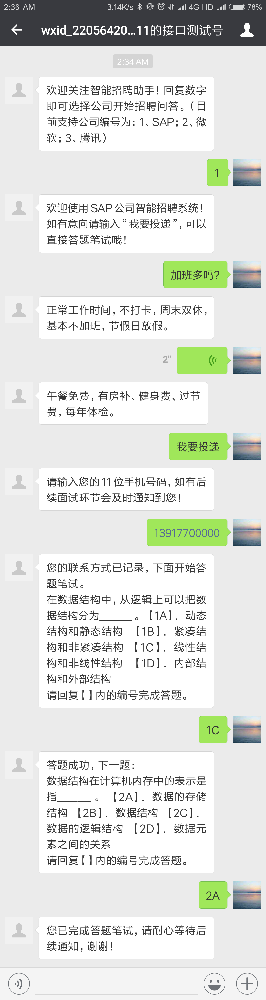
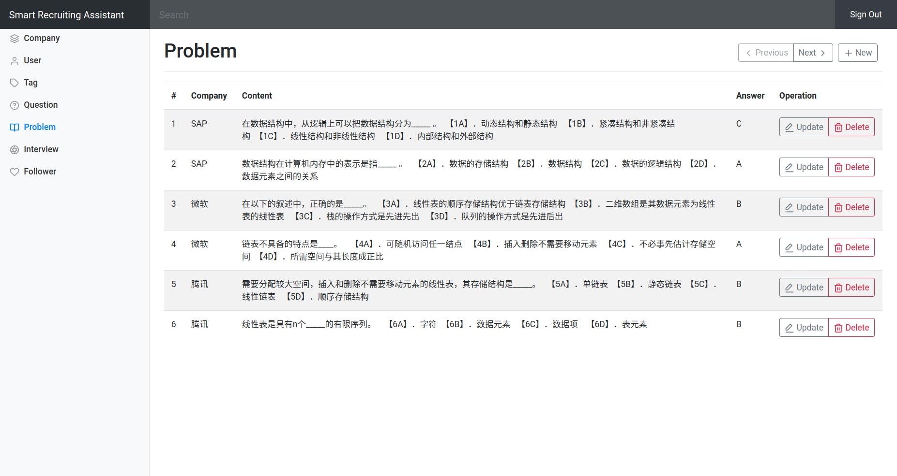

# Smart Recruiting Assistant





## Steps to launch the project
### Preliminary
- MySQL 5.6+
- Java 1.8+
- Maven 3.0+

### Package
```
cd recruiting-assistant/
mvn package -DskipTests
```

### Database
Execute the following SQLs to create the database and user with proper authorities.
```sql
create database recruiting_assistant
create user 'recruiting_assistant'@'localhost' identified by 'recruiting_assistant';
grant all on recruiting_assistant.* to 'recruiting_assistant'@'localhost';
```

### Execution
The package has embedded Tomcat. You can launch the server by the following command.
```
cd target/
java -jar recruiting-assistant-1.0-SNAPSHOT.jar
```
You should not close this shell.

### Initialization
Access the following URL to generate default accounts.
```
http://localhost:8888/init
```
You can change the server port in `application.properties`.
```properties
server.port=8888
```

## Dashboard and Default Accounts
After finished the above steps, you can access `http://localhost:8888/admin` to sign in the Dashboard.

You should use the following default accounts for the first time.
- Super Administrator: 
  - username: `admin`
  - password: `admin`
- Company Manager:
  - username: `sap`
  - password: `sap`

## Users and Authorities
Super Administrators can create, list, update and delete companies, users and tags.
But Company Managers can only modify the information of their own company.

One company allows to have multiple managers, but one manager can only belong to one company.

## APIs
Please refer to `document\api.md`.
